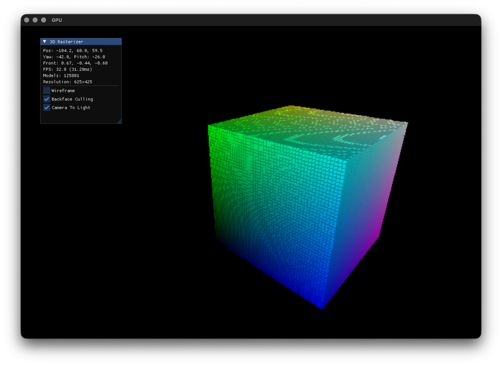

#### EXTENSION TO WRAPPER FOR X11
- inspired by: 
- https://www.youtube.com/watch?v=ZtnIeybDNC4
- https://www.youtube.com/watch?v=ztkh1r1ioZo
- to show what can be done easily
- actual wrapper: https://github.com/felixjaschul/wrapperX11
- real engine is under :
- (2d): https://github.com/felixjaschul/gameengineX11
- (3d): https://github.com/felixjaschul/rasterizerengineX11

#### THIS IS IT:

#### TL:DR
you run it with cmake lol. Good luck
- should run on everything because SDL 
- use the git clone --recursive to get the submodules (SDL3, ImGui, my own wrapper for SDL3 + ImGui or X11)
